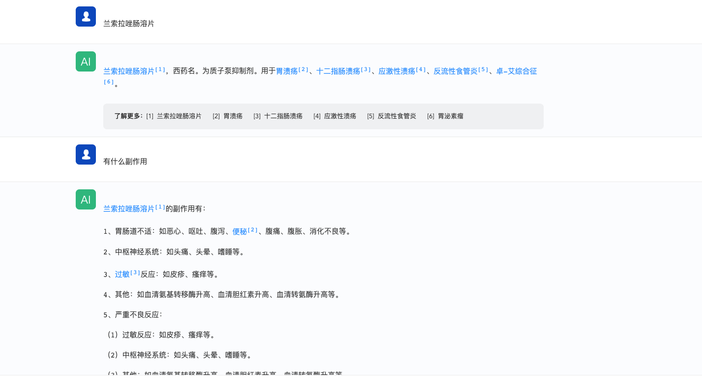
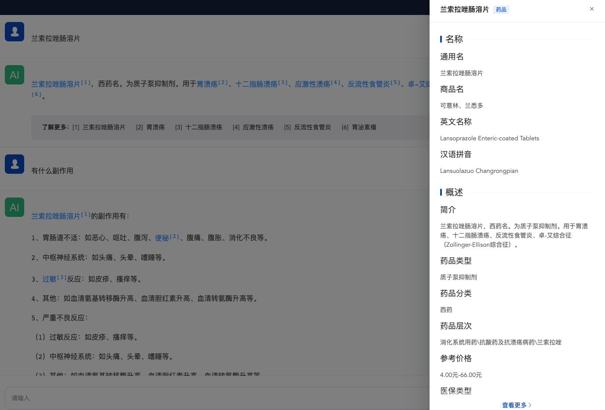

# 启真医学大模型

QiZhenGPT: An Open Source Chinese Medical Large Language Model


本项目利用[启真医学知识库](http://www.mk-base.com)构建的中文医学指令数据集，并基于此在LLaMA-7B模型上进行指令精调，大幅提高了模型在中文医疗场景下效果，首先针对药品知识问答发布了评测数据集，后续计划优化疾病、手术、检验等方面的问答效果，并针对医患问答、病历自动生成等应用展开拓展。

## 更新记录及计划

### 更新
[2023/05/25] 开源[药品适应症评测数据集](./data/eval/%E8%8D%AF%E5%93%81%E9%80%82%E5%BA%94%E7%97%87%E8%AF%84%E6%B5%8B%E6%95%B0%E6%8D%AE%E9%9B%86.csv);

[2023/05/24] 开源启真医学大模型体验版（QiZhen- Checkpoint-6000）;

[2023/05/23] 开源启真医学大模型体验版（QiZhen- Checkpoint-3500），旨在提高医学领域药品知识问答的准确性；

### 计划

1. 继续在该指令集训练，进一步提高模型效果，并将模型进行开源；
2. 使用指令数据微调MOSS；
3. 使用指令数据微调ChatGLM-6B；
4. 构造并开源药品知识问答数据集，并对开源模型进行评测，发布评测结果；
5. 构造疾病知识指令集，使用该指令集训练新模型，并将模型进行开源；
6. 使用启真医学知识库文本对LLaMA继续进行预训练，增强LLaMA在中文医疗领域的自然语言处理的基础能力；

## 指令数据集构建

目前大多数开源的ChatLLM项目使用的是其他模型（如：ChatGPT）生成的指令数据，其不可避免的存在数据幻想的问题，数据幻想问题将严重影响LLM在实际场景中的应用和拓展。因此，本项目为了提高医疗领域的知识问答的准确性，使用如下方式构造指令数据集：

1. 启真医学知识库收录的真实医患知识问答数据（疾病、药品、检查检验、手术、预后、食物等），共计`560K`条指令数据；
2. 药品知识数据：在启真医学知识库的药品文本知识基础上，通过对半结构化数据设置特定的问题模板（如：“{药品}的适应病症是什么？”）构造指令数据集，共计`180K`条指令数据；

## 训练细节

本项目基于[Chinese-LLaMA-Plus-7B](https://github.com/ymcui/Chinese-LLaMA-Alpaca)进行指令微调，该项目在7张A800(80G)上进行训练，本次开源的是LoRA权重为训练过程中的第`3500 steps`（训练了23h）	。

## 模型下载

|          模型           | 指令数据集 |      Base Model       |                           LoRA下载                           |
| :---------------------: | :--------: | :-------------------: | :----------------------------------------------------------: |
| QiZhen- Checkpoint-3500 |    740K    | Chinese-LLaMA-Plus-7B | [百度网盘](https://pan.baidu.com/s/1KQIF-dUsL7Nrj8UeNuFUiw?pwd=ivgg) |
| QiZhen- Checkpoint-6000 |    740K    | Chinese-LLaMA-Plus-7B | [百度网盘](https://pan.baidu.com/s/1KQIF-dUsL7Nrj8UeNuFUiw?pwd=ivgg) |

## A Quick Start

1. 环境安装；

```bash
# pip install -r requirements.txt
```

2. 获取Chinese-LLaMA-Plus-7B，详情见[这里](https://github.com/ymcui/Chinese-LLaMA-Alpaca/wiki/%E6%A8%A1%E5%9E%8B%E5%90%88%E5%B9%B6%E4%B8%8E%E8%BD%AC%E6%8D%A2)；

3. 将模型下载并放在lora目录下；

4. 执行scripts/merge_llama_plus.sh 脚本；

```
sh scripts/merge_llama_plus.sh
```

5. 启动demo；

```
python gradio_demo.py
```

## 预研

启真医学大模型坚持“数据+知识双轮驱动”的技术路线，通过大模型技术和医学知识库的紧密结合，融合医疗应用场景中的实际需求，从医学数据治理、医学推理、医患问答、病历自动生成、临床决策辅助支持系统等方面开展迭代研发，助力大模型技术在医疗行业的落地和应用实践。下图是“启真医学知识库辅助大模型生成答案”的案例，该项技术在测试后择机发布。






## 模型效果对比

### 测试1

- input：非布司他能治疗什么疾病
- ChatGLM：非布司他是一种用于治疗哮喘的新药,属于β2受体激动剂。它已经被批准用于治疗以下疾病:  1. 哮喘:非布司他是一种β2受体激动剂,可以刺激β2受体,从而缓解哮喘症状,包括呼吸困难、气促和胸闷。  2. 慢阻肺:非布司他也可以用于缓解慢阻肺引起的症状,包括呼吸急促、气促和咳嗽。  3. 过敏性鼻炎:非布司他可以减轻过敏性鼻炎引起的症状,包括鼻塞、流涕和打喷嚏。  4. 其他疾病:非布司他也被用于治疗其他疾病,如胡萝卜素血症和皮肤划痕症等。  需要注意的是,非布司他是一种药物,其治疗效果和安全性因人而异,最好在医生的指导下使用。
- ChatGPT：非布司他（Fubuxitam）是一种药物，目前我的知识截至于2021年，不包括最新的医学研究和药物进展。根据我了解到的信息，非布司他是一种血小板凝集抑制剂，通常用于预防和治疗血栓性疾病。它可用于预防心脏病、脑血管疾病（例如中风）、静脉血栓栓塞（例如深静脉血栓形成和肺栓塞）以及其他与血栓形成有关的情况。<br/><br/>然而，由于我无法提供最新的医学信息，我建议您咨询医疗专业人士或药剂师以获取关于非布司他的最新信息，并确切了解它在治疗特定疾病方面的适应症和有效性。
- QiZhen-Checkpoint-3500：本品用于痛风患者高尿酸血症的长期治疗。<br />本品为处方药，必须由医生根据病情开处方拿药，并遵医嘱用药，包括用法、用量、用药时间等。不得擅自按照药物说明书自行用药。

### 测试2

- Input：氟奋乃静癸酸酯注射液的适应症

- ChatGLM：氟奋乃静癸酸酯注射液是一种药物,适应症如下:  1. 用于治疗抑郁症、焦虑症和失眠等神经精神症状; 2. 用于治疗癫痫、脑外伤和脑动脉硬化等神经系统疾病; 3. 用于缓解慢性疼痛,如痛经、关节炎等疼痛性疾病; 4. 用于改善学习能力和记忆能力,可用于儿童和青少年的智力开发和改善学习效果; 5. 用于预防艾滋病病毒感染和治疗艾滋病。  氟奋乃静癸酸酯注射液是一种口服用药,通常用于治疗抑郁症、焦虑症和失眠等疾病。需要根据医生的建议来制定治疗方案。使用氟奋乃静癸酸酯注射液时,应遵循医生的建议和药品说明书中的用药方法和剂量。

- ChatGPT：氟奋乃静癸酸酯注射液（Flumazenil Injection）是一种用于治疗苯二氮䓬类药物（如安定类药物）过量或过度使用所引起的镇静或催眠状态的药物。它作为一种苯二氮䓬类受体拮抗剂，能够逆转苯二氮䓬类药物的中枢神经系统抑制作用。<氟奋乃静癸酸酯注射液主要用于以下适应症：<br/><br/>1. 苯二氮䓬类药物过量：当患者因安定类药物过量或过度使用而出现昏迷、嗜睡、呼吸抑制等症状时，氟奋乃静癸酸酯注射液可用于逆转这些症状。<br/><br/>2. 麻醉中逆转：氟奋乃静癸酸酯注射液可用于在手术或其他麻醉操作结束后逆转苯二氮䓬类药物的镇静效果，帮助患者恢复清醒状态。<br/><br/>3. 诊断用途：氟奋乃静癸酸酯注射液还可用于辅助诊断苯二氮䓬类药物中毒或过量情况。<br/><br/>请注意，氟奋乃静癸酸酯注射液应由专业医生根据具体情况进行合理的使用和监控。在使用该药物之前，应仔细阅读并遵循药物说明书，并遵循医生的指导和建议。

- QiZhen-Checkpoint-3500：本品用于精神分裂症、躁狂症等。 也可用于肌紧张性疼痛。


### 测试3

- input：藏青果茶有哪些主要作用？
- ChatGLM：藏青果茶是一种天然的饮品,主要由青果、茶叶、蜂蜜等多种材料制成。它的主要作用包括:  1. 提高免疫力:藏青果茶中含有丰富的营养成分,如维生素C、维生素E等,可以增强人体的免疫力,提高身体的抵抗力,预防疾病的发生。  2. 促进消化:藏青果茶中含有丰富的纤维素,可以促进肠胃蠕动,帮助消化,预防便秘的发生。  3. 抗氧化作用:藏青果茶中的青果提取物具有较强的抗氧化作用,可以清除体内自由基,延缓衰老,预防疾病。  4. 降低血脂:藏青果茶中的茶叶提取物具有一定的降低血脂的作用,可以预防和治疗高血脂症。  5. 改善睡眠:藏青果茶中的蜂蜜具有一定的镇静作用,可以帮助缓解压力,改善睡眠质量,提高身体的自我修复能力。
- ChatGPT：藏青果茶是一种以藏青果为主要原料制作的茶饮品，据我所知，它具有以下主要作用：<br/><br/>1. 抗氧化作用：藏青果富含多种天然抗氧化剂，如多酚类化合物和维生素C，可帮助清除体内自由基，减缓细胞老化，增强免疫力。<br/><br/>2. 促进消化：藏青果茶具有良好的消化刺激作用，有助于促进胃肠道蠕动，改善消化功能，缓解胃部不适和消化不良。<br/><br/>3. 提供营养：藏青果富含维生素C、维生素E、维生素B群、矿物质等营养物质，饮用藏青果茶可以为身体提供所需的营养元素。<br/><br/>4. 减肥瘦身：藏青果茶被认为具有减肥的效果，它可以促进新陈代谢，加速脂肪分解和燃烧，帮助减少体重和脂肪积累。<br/><br/>5. 抗炎镇痛：藏青果茶含有一些具有抗炎和镇痛作用的成分，可以缓解关节疼痛、肌肉酸痛和头痛等不适。<br/><br/>6. 改善睡眠：藏青果茶有助于放松神经系统，具有镇静和安抚作用，可以改善睡眠质量，缓解失眠问题。<br/><br/>需要注意的是，以上作用主要是基于藏青果茶的传统用途和某些研究结果，具体效果因人而异，且可能受到个体差异和使用方式的影响。如果您有特定的健康问题或需要服用药物，建议咨询医生或专业保健人员的建议。
- QiZhen-Checkpoint-3500：清热解毒、生津止渴。 可缓解发热、口渴、咽喉肿痛等症状。

### 测试4

- input：高血压可以吃什么
- ChatGLM：高血压的治疗需要根据具体情况而定,需要结合血压值、年龄、性别、健康状况、病史等因素进行评估。以下是一些可能对控制高血压有帮助的建议: 1. 高纤维饮食:膳食纤维可以降低胆固醇水平,增加血管弹性,从而减少高血压的风险。建议摄入高纤维的食物包括水果、蔬菜、全麦面包、燕麦、豆类等。 2. 低脂肪饮食:摄入低脂肪的食物可以降低血液中的胆固醇和血压。建议选择低脂肪的肉类(如鸡肉、火鸡肉等)和鱼类,并尽量避免高脂肪的加工食品。 3. 多喝水:饮水量充足可以降低血液中的胆固醇和血压,保持身体的水分平衡。建议每天饮水量达到1.5-2升。 4. 限制盐分摄入:过量的盐分摄入会导致血压升高,建议限制每天摄入的盐量为6克以下。 5. 控制饮酒量:过量的饮酒会导致血压升高,建议男性每天饮酒不超过两杯,女性每天饮酒不超过一杯。 6. 适当增加体育锻炼:适当的体育锻炼可以降低血压,增加身体的代谢率。建议每周进行至少150分钟的有氧运动,如快走、骑车、游泳等。 高血压的治疗需要综合考虑饮食、生活方式、药物治疗等因素,建议咨询医生或营养师的建议,制定适合自己的治疗方案。
- ChatGPT：如果你有高血压，合理的饮食选择对于控制血压非常重要。以下是一些可以考虑的食物和饮食建议：<br/><br/>1. 低钠食物：限制钠摄入对于高血压患者至关重要。避免或减少高盐食物，如加工食品、咸肉、咸鱼和腌制食品。选择新鲜食材，并用低钠调味品代替盐。<br/><br/>2. 高钾食物：增加摄入富含钾的食物，如香蕉、土豆、菠菜、橙子和番茄等。钾可以帮助减轻钠对血压的影响。<br/><br/>3. 高纤维食物：摄入足够的纤维可以有助于控制血压。选择全谷类食物（如全麦面包、燕麦片）、豆类、蔬菜和水果等富含纤维的食物。<br/><br/>4. 富含健康脂肪的食物：选择富含单不饱和脂肪酸和多不饱和脂肪酸的食物，如鱼类（鳕鱼、三文鱼）、坚果、橄榄油和亚麻籽油。<br/><br/>5. 限制咖啡因和酒精摄入：大量咖啡因和酒精摄入可能会导致血压升高。适度饮用咖啡和限制酒精摄入。<br/><br/>6. 控制碳水化合物摄入：尽量选择低GI（血糖指数）的碳水化合物，如全谷类食物、豆类和蔬菜。避免过多食用高GI食物，如白米饭、白面包和糖果。<br/><br/>此外，每个人的情况都不同，最好咨询专业医生或营养师，根据自身的健康状况和饮食需求进行个性化的饮食计划。
- QiZhen-Checkpoint-3500：高血压患者可以吃低钠、低脂肪、高维生素C、高膳食纤维、高蛋白质、高钙、高钾、高锌、高镁的食物。 高血压患者的饮食原则为低钠、低脂肪、高维生素C、高膳食纤维、高蛋白质、高钙、高钾、高锌、高镁饮食。 （1）低钠：钠盐摄入过多可以引起水钠潴留，导致血压升高或抵消降压药的作用，高血压患者每人每日食盐量以不超过6g为宜； （2）低脂肪：高血压患者要减少脂肪摄入，选择多不饱和脂肪酸而不是饱和脂肪酸； （3）高维生素C：多吃些富含维生素C的新鲜水果和蔬菜，如青椒、西红柿、胡萝卜、韭菜、菠菜、西兰花等； （4）高膳食纤维：多吃些粗粮，如玉米、高粱、荞麦、燕麦等； （5）高蛋白质：摄入充足的蛋白质可以增强体质，提高机体的抗病能力，这类食物相对来说含脂肪和胆固醇的比较低，比较适合高血压患者食用，如肉类、鱼类、豆制品等； （6）高钙：多吃些含钙丰富的食物，如牛奶、骨头汤、海产品、豆制品等，可以预防骨质疏松症的发生； （7）高钾：多吃些含钾丰富的食物，如土豆、茄子、海带、莴笋等； （8）高锌：多吃些含锌丰富的食物，如瘦肉、动物内脏、坚果、海产品等。

## 实验评测

### 药品适应症评测

评测标准：随机选择`94`种药品数据，按照“{药品}的适应病症”组成指令，分别让ChatGPT（gpt3.5）、ChatGLM、QiZhen-Checkpoint-3500做出回答，然后请专业的医学人员对三个`模型的答案`与`该药品的药品说明书`进行比对评分，以下是三个评分标准：

- 标准1：模型答案命中一个适应症则回答正确；

- 标准2：模型答案命中的适应症数目大于等于药品说明书适应症数目的1/2则回答正确；

- 标准3：模型答案命中的适应症数目大于等于药品说明书适应症数目的2/3则回答正确；

|            模型            | 标准1准确率 | 标准2准确率 | 标准3准确率 |
| :------------------------: | :---------: | :---------: | :---------: |
|          ChatGLM           |   39.36%    |   23.16%    |   14.74%    |
|          ChatGPT           |   47.87%    |   30.85%    |   15.96%    |
|   QiZhen-Checkpoint-3500   |   77.66%    |   55.32%    |   40.00%    |
| **QiZhen-Checkpoint-6000** | **90.43%**  | **73.40%**  | **65.96%**  |

若QiZhen-Checkpoint-6000回复有重复内容（我们正在持续修复这个问题），请将`repetition_penalty`参数调大。

更详细的评测细节和数据后续会开源。


## 项目成员

项目组成员包括：
[姚畅](https://person.zju.edu.cn/changyao)，[王贵宣](https://github.com/DendiHust)、[邹悦]()，[张楚俊]()、[赵俊博](https://person.zju.edu.cn/jkzhao)、[余小益]()、[李宗申]()、[王成](https://github.com/wang9702)、[张适可]()、[许振影]()、[马央君]()、[江智扬]()、[伍赛](https://person.zju.edu.cn/0011057)、[鲁鹏]()、[杨杰]()。

医学支持：[相鹏]()、[丁彦]()、[陈杰]()、[刘康宏]()。


## 致谢
同时感谢浙江大学、创业慧康、联众智慧、浙江大学计算机创新技术研究院、浙江大学-网新数字健康联合研究中心、浙江创联网捷公司的其他同事的支持，以及在项目过程中提供的技术、医学、算力等方面的帮助。

此外，本项目基于以下开源项目二次开发，在此对相关项目和研究开发人员表示感谢。

- [LLaMA](https://github.com/facebookresearch/llama)
- [Standford Alpaca](https://github.com/tatsu-lab/stanford_alpaca)
- [中文LLaMA & Alpaca大模型](https://github.com/ymcui/Chinese-LLaMA-Alpaca)


## License及免责声明

### License

详见[LICENSE](./LICENSE)

### 免责声明

**本项目相关资源仅供学术研究之用，严禁用于商业用途。** 使用涉及第三方代码的部分时，请严格遵循相应的开源协议。模型生成的内容受模型计算、随机性和量化精度损失等因素影响，本项目不对其准确性作出保证。对于模型输出的任何内容，本项目不承担任何法律责任，亦不对因使用相关资源和输出结果而可能产生的任何损失承担责任。


## 引用说明

@misc{QiZhenGPT,
  author={Chang Yao, Guixuan Wang, Junbo Zhao, Sai Wu, Gang Chen, Peng Lu},
  title = {QiZhenGPT: An Open Source Chinese Medical Large Language Model},
  year = {2023},
  publisher = {GitHub},
  journal = {GitHub repository},
  howpublished = {\url{https://github.com/CMKRG/QiZhenGPT}},
}

Technical paper is coming soon.
